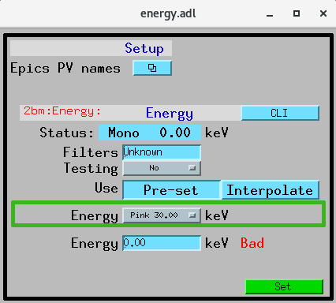
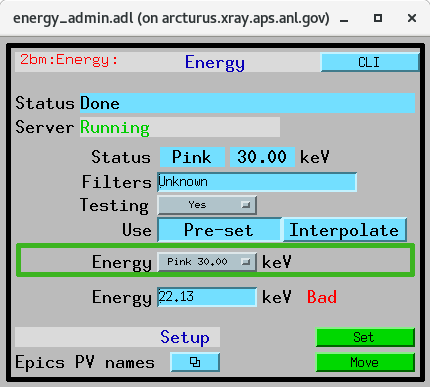
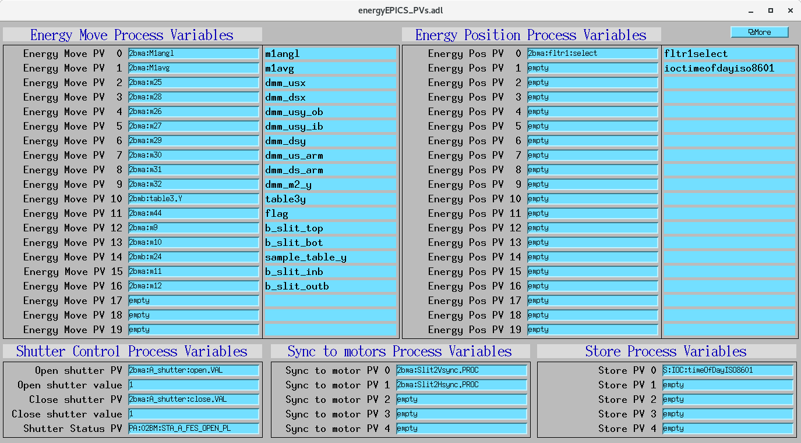

===========================
energyApp EPICS application
===========================

.. 
   toctree::
   :hidden:

   energy.template
   energy_settings.req
   energy.substitutions

energy is an EPICS application including:

- A database file and corresponding autosave request file that contain the PVs required by the energy.py base class.
- OPI screens for medm
- An example IOC application that can be used to run the above databases.
  The databases are loaded in the IOC with the example substitutions file, 
  :doc:`energy.substitutions`.

Base class files
================
The following tables list all of the records in the energy.template file.
These records are used by the energy base class and so are required.

energy.template
---------------

This is the database file that contains only the PVs required by the energy.py base class
:doc:`energy.template`.

Energy status via Channel Access
~~~~~~~~~~~~~~~~~~~~~~~~~~~~~~~~

.. cssclass:: table-bordered table-striped table-hover
.. list-table::
  :header-rows: 1
  :widths: 5 5 90

  * - Record name
    - Record type
    - Description
  * - $(P)$(R)EnergyStatus
    - waveform
    - This record will be updated with the scan status while scanning.
  * - $(P)$(R)ServerRunning
    - bi
    - This record will be ``Running`` if the Python server is running and ``Stopped`` if not.
      It is controlled by a watchdog timer, and will change from ``Running`` to ``Stopped``
      within 5 seconds if the Python server exits.

Energy information
~~~~~~~~~~~~~~~~~~

.. cssclass:: table-bordered table-striped table-hover
.. list-table::
  :header-rows: 1
  :widths: 5 5 90

  * - Record name
    - Record type
    - Description
  * - $(P)$(R)Energy
    - ao
    - Contains the energy value in keV
  * - $(P)$(R)EnergyMode
    - mbbo
    - Contains the energy mode, options are Pink, Mono and White

Energy change
~~~~~~~~~~~~~

.. cssclass:: table-bordered table-striped table-hover
.. list-table::
  :header-rows: 1
  :widths: 5 5 90

  * - Record name
    - Record type
    - Description
  * - $(P)$(R)EnergyInRange
    - bo
    - True when the energy selected is within pre-calibrated min-max energies
  * - $(P)$(R)EnergyCalibrationUse
    - mbbo
    - set to select use of Pre-set or interpolation
  * - $(P)$(R)EnergyMove
    - busy
    - when set to 1 starts the energy move
  * - $(P)$(R)EnergyTesting
    - bo
    - when set beamline component move is disabled
  * - $(P)$(R)EnergyBusy
    - busy
    - when set to 1 the beamline is busy with the energy move

Shutter control
~~~~~~~~~~~~~~~

.. cssclass:: table-bordered table-striped table-hover
.. list-table::
  :header-rows: 1
  :widths: 5 5 90

  * - Record name
    - Record type
    - Description
  * - $(P)$(R)CloseShutterPVName
    - stringout
    - Contains the name of the PV to close the shutter
  * - $(P)$(R)CloseShutterValue
    - stringout
    - Contains the value to write to close the shutter
  * - $(P)$(R)OpenShutterPVName
    - stringout
    - Contains the name of the PV to open the shutter
  * - $(P)$(R)OpenShutterValue
    - stringout
    - Contains the value to write to open the shutter

Shutter status
~~~~~~~~~~~~~~

.. cssclass:: table-bordered table-striped table-hover
.. list-table::
  :header-rows: 1
  :widths: 5 5 90

  * - Record name
    - Record type
    - Description
  * - $(P)$(R)ShutterStatusPVName
    - stringout
    - Contains the name of the PV with the shutter status

Energy Move PV Names
~~~~~~~~~~~~~~~~~~~~

.. cssclass:: table-bordered table-striped table-hover
.. list-table::
  :header-rows: 1
  :widths: 5 5 90

  * - Record name
    - Record type
    - Description
  * - $(P)$(R)EnergyMove0PVName
    - stringout
    - Contains the name of the PV that will move in an energy change, both to a pre-selected and to an interpolated position
  * - $(P)$(R)EnergyMove0PVDesc
    - stringout
    - It is used to store the PV description. If available this will be derived from the EnergyMove0PVName description if not it will be created using the EnergyMove0PVName itself. These PVs will be used as key entry in the dictionary storing the pre-calibrated position for each motor.

Energy Pos PV Names
~~~~~~~~~~~~~~~~~~~

.. cssclass:: table-bordered table-striped table-hover
.. list-table::
  :header-rows: 1
  :widths: 5 5 90

  * - Record name
    - Record type
    - Description
  * - $(P)$(R)EnergyPos0PVName
    - stringout
    - Contains the name of the PV that will move in an energy change to a pre-selected position. This motors will not move to an interpolated position.
  * - $(P)$(R)EnergyPos0PVDesc
    - stringout
    - It is used to store the PV description. If available this will be derived from the EnergyMove0PVName description if not it will be created using the EnergyMove0PVName itself. These PVs will be used as key entry in the dictionary storing the pre-calibrated position for each motor.

Sync PV Names
~~~~~~~~~~~~~

.. cssclass:: table-bordered table-striped table-hover
.. list-table::
  :header-rows: 1
  :widths: 5 5 90

  * - Record name
    - Record type
    - Description
  * - $(P)$(R)Sync0PVName
    - stringout
    - Contains the name of the sync to motor PV that will be set to 1 at the end of an energy change.

Store PV Names
~~~~~~~~~~~~~~

.. cssclass:: table-bordered table-striped table-hover
.. list-table::
  :header-rows: 1
  :widths: 5 5 90

  * - Record name
    - Record type
    - Description
  * - $(P)$(R)Store0PVName
    - stringout
    - Contains the name of PVs that will store in the energy json for logging purposes, e.g. S:IOC:timeOfDayISO8601.

Beamline-specific files
=======================
The following files are for the beamline-specific derived classes.

Beamline 2-BM
-------------

These are the files that are specific to the Energy2BM derived class used at APS beamline 2-BM.

energy_2BM.template
~~~~~~~~~~~~~~~~~~~

This is database file for the Energy2BM derived class
:doc:`energy_2BM.template`.

The following tables list all of the records in the energy_2BM.template file.
This file is used for records needed by the energy_2bm derived class, and also
for metadata PVs that should be saved in the energy configuration file.

Energy information
^^^^^^^^^^^^^^^^^^

.. cssclass:: table-bordered table-striped table-hover
.. list-table::
  :header-rows: 1
  :widths: 5 5 90

  * - Record name
    - Record type
    - Description
  * - $(P)$(R)Filters
    - stringout
    - Contains the list of filters (material and thickness) added manually

Energy change
^^^^^^^^^^^^^

.. cssclass:: table-bordered table-striped table-hover
.. list-table::
  :header-rows: 1
  :widths: 5 5 90

  * - Record name
    - Record type
    - Description
  * - $(P)$(R))EnergyChoice
    - mbbo
    - Contains the pre-calibrated energy values in keV in the format mode value, i.e. Mono 20.00

Beamline 32-ID
--------------

These are the files that are specific to the Energy32ID derived class used at APS beamline 32-ID.

energy_32ID.template
~~~~~~~~~~~~~~~~~~~~

This is database file for the Energy32ID derived class
:doc:`energy_32ID.template`.

The following tables list all of the records in the energy_32ID.template file.
This file is used for records needed by the energy_32id derived class, and also
for metadata PVs that should be saved in the energy configuration file.

Energy change
^^^^^^^^^^^^^

.. cssclass:: table-bordered table-striped table-hover
.. list-table::
  :header-rows: 1
  :widths: 5 5 90

  * - Record name
    - Record type
    - Description
  * - $(P)$(R))EnergyChoice
    - mbbo
    - Contains the pre-calibrated energy values in keV in the format mode value, i.e. Mono 20.00

GUI
===

The following are MEDM screens to interact with the energy EPICS IOC:

    User control screen

    Admin control screen

    Setup configuration screen

.. warning:: If the above PVs are changed **energy** python server must be restarted.

