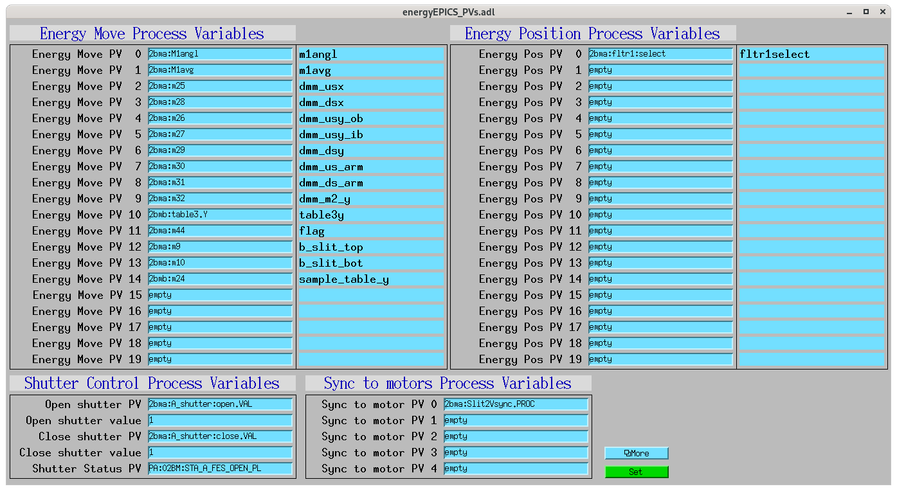

===============================
energyApp EPICS application
===============================

.. 
   toctree::
   :hidden:

   energy.template
   energy_settings.req
   energy.substitutions

energy includes a complete example EPICS application, including:

- A database file and corresponding autosave request file that contain the PVs required by the energy.py base class.
- OPI screens for medm
- An example IOC application that can be used to run the above databases.
  The databases are loaded in the IOC with the example substitutions file, 
  :doc:`energy.substitutions`.

Base class files
================
The following tables list all of the records in the energy.template file.
These records are used by the energy base class and so are required.

energy.template
-------------------

This is the database file that contains only the PVs required by the energy.py base class
:doc:`energy.template`.

    
medm files
----------

energy.adl
^^^^^^^^^^^^^^

The following is the MEDM screen :download:`energy.adl <../../energyApp/op/adl/energy.adl>` during a scan. 
The status information is updating.

.. image:: img/energy_01.png
    :width: 75%
    :align: center

energyEPICS_PVs.adl
^^^^^^^^^^^^^^^^^^^^^^^

The following is the MEDM screen :download:`energyEPICS_PVs.adl <../../energyApp/op/adl/energyEPICS_PVs.adl>`. 

If these PVs are changed tomoscan must be restarted.

