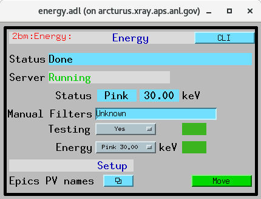
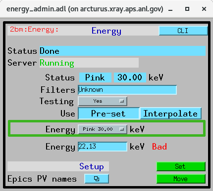
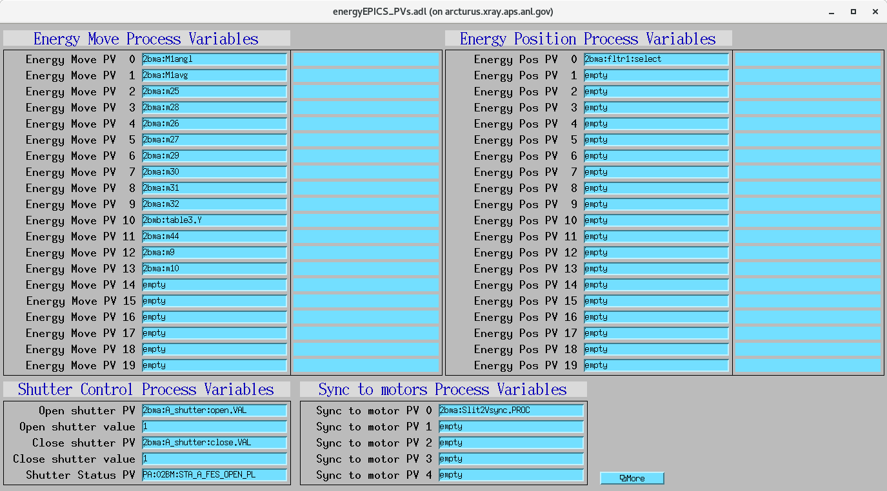

=====
Usage
=====

CLI
===

To set the beamline energy to 20 keV::

    $ energy set --energy 20 

If the selected energy is not included in the pre-calibrated energy list, **energy** will interpolate all motor positions using the values
of the closest calibrated energies.

To set the beamline for pink beam with 30keV cut off:

::

    $ energy --mode Pink --energy 30

Add energy
----------

To save the beamline motor positions and associate them to an energy to be used at a later time::

    $ energy add --energy 28.32

The above will add 28.32 to the pre-calibrated energy list or, if already exists, update the beamline motor positions. 
To restore it::

    $ energy set --energy 28.32 

Add/Remove precalibrated energies
---------------------------------

To associate the current beamline positions to new energy value or update and existing one:

::

    $ energy add --energy 28.32

the newly added energy will be used as start/end of the intepolation interval

To remove an energy value from the list of calibrated energies:

::

    $ energy delete --energy 28.32

To list of all available options::

    $ energy -h
    usage: energy [-h] [--config FILE] [--version]  ...

    optional arguments:
      -h, --help     show this help message and exit
      --config FILE  File name of configuration file
      --version      show program's version number and exit

    Commands:
      
        init         Usage: energy init - Create configuration file and restore the original preset energy calibration file
        set          Usage: energy set --energy 20 - Set the beamline to the --energy value using a precalibrated list or, if missing,
                     a linear interpolation point between the two closest calibrared values
        add          Usage: energy add --energy 20 - Associate the current beamline positions to --energy value
        delete       Usage: energy delete --energy 20 - Remove --energy value from the preset energy calibration file
        restore      Usage: energy restore - Restore original preset energy calibration file.
        status       Usage: energy status - Show status

to list of all **energy set** options::

    $ energy set -h

Testing mode
------------

In testing mode, the motor positions are printed but not actual motor motion occurs. To enable testing mode set:: 

    $ energy set --testing

Configuration File
------------------

The energy status is stored in **~/logs/energy.conf**. You can create a template with::

    $ energy init

**~/logs/energy.conf** is constantly updated to keep track of the last stored parameters, as initalized by **init** or modified by setting a new option value. 
For example to set the beamline to the last energy configuration ::

    $ energy set

GUI
===

X-ray energy changes at the beamline are managed using the `energy cli <https://github.com/xray-imaging/energy>`_ tool. The user interface offers two modes for adjusting the energy: Pre-set and Interpolate.

**User Control Screen – Pre-set Mode**

The default Pre-set mode lets you move the beamline to a pre-calibrated energy value:

   User control screen

#. Select an energy from the drop-down list.
#. Click Move to initiate the energy change.

This mode ensures all relevant components move to positions corresponding to a pre-defined energy configuration.

**Admin Control Screen – Interpolate Mode**

The Interpolate mode, available from the admin control screen, allows you to enter an arbitrary energy value not found in the pre-set list. In this mode:

- Positions for all Process Variables (PVs) listed in the **Energy Move** list are calculated by linear interpolation between the two closest calibrated energy points.
- PVs in the **Energy Position** list are excluded from the interpolation and will not be moved.

    Admin control screen

**Configuration Screen**

A separate configuration screen allows administrators to manage which PVs are affected during an energy change:

- You can add or remove PVs from the Energy Move list.
- Shutter control PVs can be configured.
- The **Sync to Motor** list allows you to define virtual motors that will automatically synchronize after each energy change.

    Setup configuration screen

.. warning:: If the above PVs are changed **energy** python server must be restarted.

